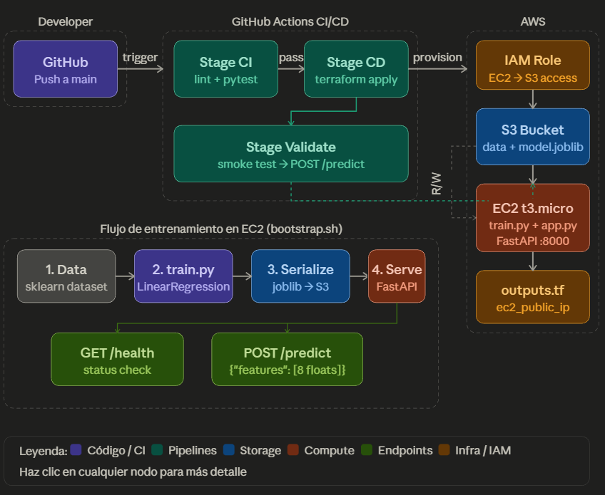

# E2E_Terraform

## Arquitectura

GitHub Push → GitHub Actions CI/CD → Terraform Apply
    ├── S3 Bucket      → almacena model.joblib
    ├── EC2 t3.micro   → entrena modelo + sirve FastAPI :8000
    └── IAM Role       → permite a EC2 leer/escribir S3 sin credenciales hardcodeadas



## Requisitos previos

| Herramienta     | Versión mínima | Para qué se usa                     |
|-----------------|---------------|-------------------------------------|
| Python          | 3.11          | Entrenamiento e inferencia local    |
| Terraform       | 1.6           | Provisionar infra en AWS            |
| AWS CLI         | 2.x           | Verificar recursos y logs           |
| Git             | cualquier     | Control de versiones                |

**Cuenta de AWS** con permisos para:
`AmazonS3FullAccess`, `AmazonEC2FullAccess`, `IAMFullAccess`

## Configuración inicial

### 1. Clonar el repositorio

```bash
git clone https://github.com/<TU_ORG>/mlops-housing.git
cd mlops-housing
```

### 2. Instalar dependencias Python

```bash
python -m venv .venv
source .venv/bin/activate        # Windows: .venv\Scripts\activate
pip install -r requirements.txt
```

### 3. Configurar GitHub Secrets (CI/CD)

En tu repositorio → **Settings → Secrets and variables → Actions → New repository secret**:

| Secret                   | Valor                                    |
|--------------------------|------------------------------------------|
| `AWS_ACCESS_KEY_ID`      | Tu Access Key ID de AWS IAM              |
| `AWS_SECRET_ACCESS_KEY`  | Tu Secret Access Key de AWS IAM          |

> El usuario IAM necesita los permisos listados en Requisitos previos.

### Flujo detallado

| Paso | Qué ocurre | Responsable |
|------|-----------|-------------|
| 1 | Dev hace `git push` a `main` | Todos |
| 2 | GitHub Actions ejecuta `flake8` + `pytest` | P4 + P5 |
| 3 | Si CI pasa → `terraform apply` provisiona S3, EC2, IAM | P3 + P4 |
| 4 | EC2 ejecuta `bootstrap.sh`: instala deps, corre `train.py` | P1 + P3 |
| 5 | `train.py` entrena el modelo y sube `model.joblib` a S3 | P1 |
| 6 | `app.py` descarga el modelo de S3 y lanza FastAPI en `:8000` | P2 |
| 7 | GitHub Actions corre smoke test contra `POST /predict` | P5 |

## Roles del equipo

| Persona | Módulo | Archivo principal | Entregable |
|---------|--------|------------------|------------|
| P1 | Training Pipeline | `src/train.py` | Modelo entrenado + subido a S3 |
| P2 | Inference API | `src/app.py` | FastAPI con `/predict` y `/health` |
| P3 | Infrastructure | `infra/*.tf` + `scripts/bootstrap.sh` | Recursos AWS funcionando |
| P4 | CI/CD Pipeline | `.github/workflows/deploy.yml` | Pipeline verde en GitHub Actions |
| P5 | Testing | `tests/*.py` | Unit tests + smoke test pasando |

## Contratos de interfaz

> Estos acuerdos deben quedar definidos **antes** de que el equipo empiece a codear.

| Contrato | Valor acordado |
|----------|---------------|
| Nombre del bucket S3 | `mlops-housing-{team_id}` |
| Ruta del modelo | `s3://bucket/models/model.joblib` |
| Puerto de la API | `8000` |
| Output de Terraform | `ec2_public_ip` |

### Usar el Dataset SK Learn

from sklearn.datasets import fetch_california_housing

california_housing = fetch_california_housing(as_frame=True)

### Schema del endpoint `POST /predict`

**Request**
```json
{
  "features": [8.3252, 41.0, 6.9841, 1.0238, 322.0, 2.5556, 37.88, -122.23]
}
```

**Orden de los 8 features:** `MedInc` · `HouseAge` · `AveRooms` · `AveBedrms` · `Population` · `AveOccup` · `Latitude` · `Longitude`

**Response**
```json
{
  "prediction": 4.1523,
  "features_received": [...],
  "model_version": "linear_regression_v1"
}
```

> El valor de `prediction` está en múltiplos de $100,000 USD. Un resultado de `4.15` = ~$415,000 USD.

## Checklist de entrega

### Fase 0 — Setup
- [ ] `team_id` definido en `infra/variables.tf`
- [ ] GitHub Secrets configurados (`AWS_ACCESS_KEY_ID`, `AWS_SECRET_ACCESS_KEY`)
- [ ] Contratos de interfaz acordados por todo el equipo
- [ ] Repositorio creado con la estructura base de carpetas

### Fase 1 — Desarrollo
- [ ] `train.py` corre localmente y genera `model.joblib`
- [ ] `app.py` responde en `localhost:8000` con un modelo local
- [ ] `terraform plan` sin errores
- [ ] `deploy.yml` válido (sin errores de YAML)
- [ ] Al menos 3 unit tests pasando con `pytest`

### Fase 2 — Integración
- [ ] Push a `main` dispara el pipeline en GitHub Actions
- [ ] Job CI pasa (lint + tests verdes)
- [ ] `terraform apply` crea recursos sin error
- [ ] `model.joblib` visible en el bucket S3
- [ ] Smoke test retorna HTTP 200 con predicción numérica

### Fase 3 — Cierre
- [ ] `terraform destroy` ejecutado ← **obligatorio**
- [ ] README actualizado
- [ ] Retrospectiva completada